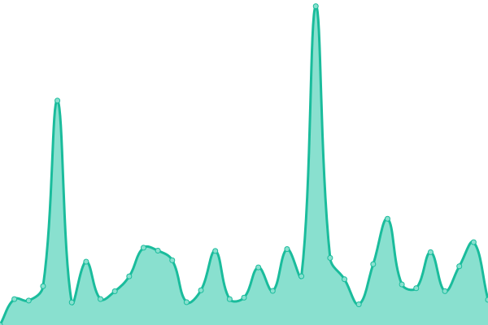
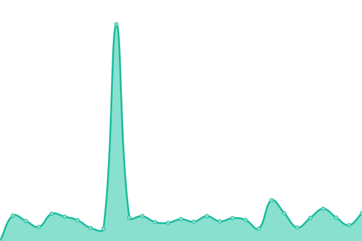

# [Live Status](https://hickoryhouse.github.io/kf): <!--live status--> **🟧 Partial outage**

<!--start: status pages-->
<!-- This summary is generated by Upptime (https://github.com/upptime/upptime) -->
<!-- Do not edit this manually, your changes will be overwritten -->
<!-- prettier-ignore -->
| URL | Status | History | Response Time | Uptime |
| --- | ------ | ------- | ------------- | ------ |
|  [Kiwi Farms Forum](https://kiwifarms.net) | 🟩 Up | [kiwi-farms-forum.yml](https://github.com/hickoryhouse/kf/commits/HEAD/history/kiwi-farms-forum.yml) | 

 1493ms
     
 | 

<a href="https://hickoryhouse.github.io/kf/history/kiwi-farms-forum">99.88%</a>
    

|  [kiwifarms.us](https://kiwifarms.us) | 🟥 Down | [kiwifarms-us.yml](https://github.com/hickoryhouse/kf/commits/HEAD/history/kiwifarms-us.yml) | 

 723ms
     
 | 

<a href="https://hickoryhouse.github.io/kf/history/kiwifarms-us">99.87%</a>
    

|  [kiwifarms.hk](https://kiwifarms.hk) | 🟩 Up | [kiwifarms-hk.yml](https://github.com/hickoryhouse/kf/commits/HEAD/history/kiwifarms-hk.yml) | 

 761ms
     
 | 

<a href="https://hickoryhouse.github.io/kf/history/kiwifarms-hk">99.88%</a>
    

|  [kiwifarms.tw](https://kiwifarms.tw) | 🟩 Up | [kiwifarms-tw.yml](https://github.com/hickoryhouse/kf/commits/HEAD/history/kiwifarms-tw.yml) | 

 795ms
     
 | 

<a href="https://hickoryhouse.github.io/kf/history/kiwifarms-tw">99.88%</a>
    

|  [kiwifarms.st](https://kiwifarms.st) | 🟩 Up | [kiwifarms-st.yml](https://github.com/hickoryhouse/kf/commits/HEAD/history/kiwifarms-st.yml) | 

 183ms
     
 | 

<a href="https://hickoryhouse.github.io/kf/history/kiwifarms-st">99.88%</a>
    

|  [kiwifarms.tv](https://kiwifarms.tv) | 🟩 Up | [kiwifarms-tv.yml](https://github.com/hickoryhouse/kf/commits/HEAD/history/kiwifarms-tv.yml) | 

 344ms
     
 | 

<a href="https://hickoryhouse.github.io/kf/history/kiwifarms-tv">100.00%</a>
    

|  [Kiwi Farms TG Archive](https://tg.josh.rs/) | 🟩 Up | [kiwi-farms-tg-archive.yml](https://github.com/hickoryhouse/kf/commits/HEAD/history/kiwi-farms-tg-archive.yml) | 

 550ms
     
 | 

<a href="https://hickoryhouse.github.io/kf/history/kiwi-farms-tg-archive">100.00%</a>
    

|  [Kiwi FOSS Git](https://git.kiwifarms.net) | 🟥 Down | [kiwi-foss-git.yml](https://github.com/hickoryhouse/kf/commits/HEAD/history/kiwi-foss-git.yml) | 

 0ms
     
 | 

<a href="https://hickoryhouse.github.io/kf/history/kiwi-foss-git">0.00%</a>
    

|  [Mad at the Internet](https://madattheinternet.com/) | 🟩 Up | [mad-at-the-internet.yml](https://github.com/hickoryhouse/kf/commits/HEAD/history/mad-at-the-internet.yml) | 

 521ms
     
 | 

<a href="https://hickoryhouse.github.io/kf/history/mad-at-the-internet">100.00%</a>
    

<!--end: status pages-->

[**Visit our status website on github.io →**](https://hickoryhouse.github.io/kf/)

This site is not affiliated with nor operated by Kiwi Farms/Lolcow LLC.

##

This repository contains the open-source uptime monitor and status page for [hickoryhouse](https://hickoryhouse.github.io/kf), powered by [Upptime](https://github.com/upptime/upptime). With [Upptime](https://upptime.js.org), you can get your own unlimited and free uptime monitor and status page, powered entirely by a GitHub repository. We use [Issues](https://github.com/hickoryhouse/kf/issues) as incident reports, [Actions](https://github.com/hickoryhouse/kf/actions) as uptime monitors, and [Pages](https://hickoryhouse.github.io/kf) for the status page.

## License

- Powered by: [Upptime](https://github.com/upptime/upptime)
- Code: [MIT](./LICENSE) © [hickoryhouse](https://hickoryhouse.github.io/kf)
- Data in the `./history` directory: [Open Database License](https://opendatacommons.org/licenses/odbl/1-0/)
